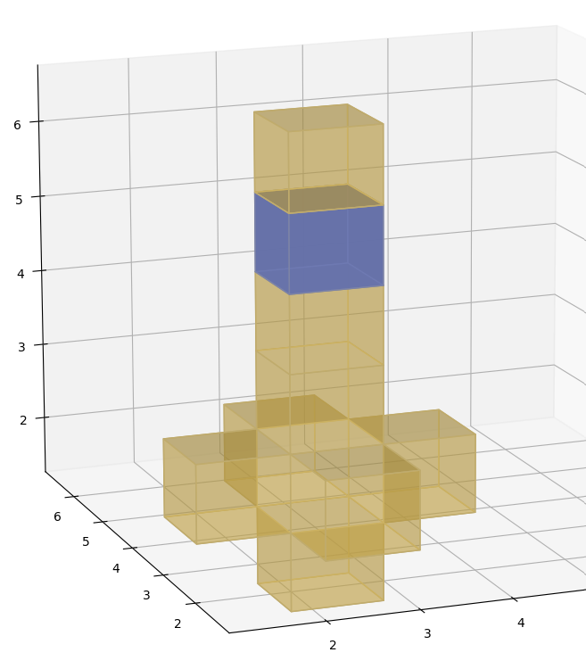
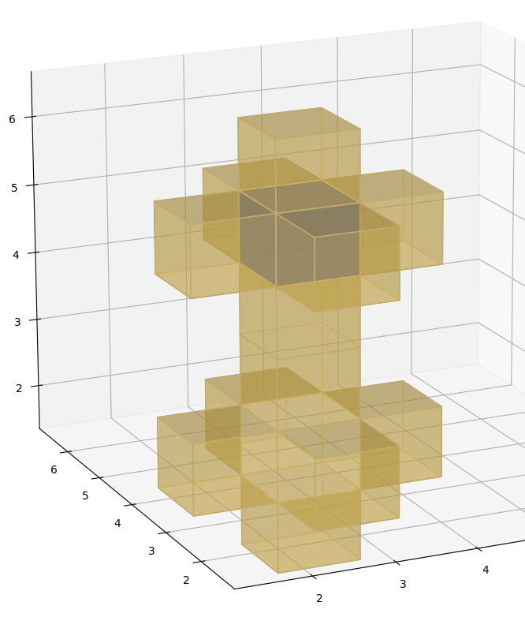
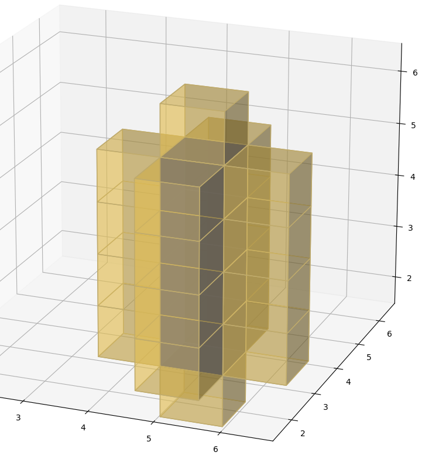
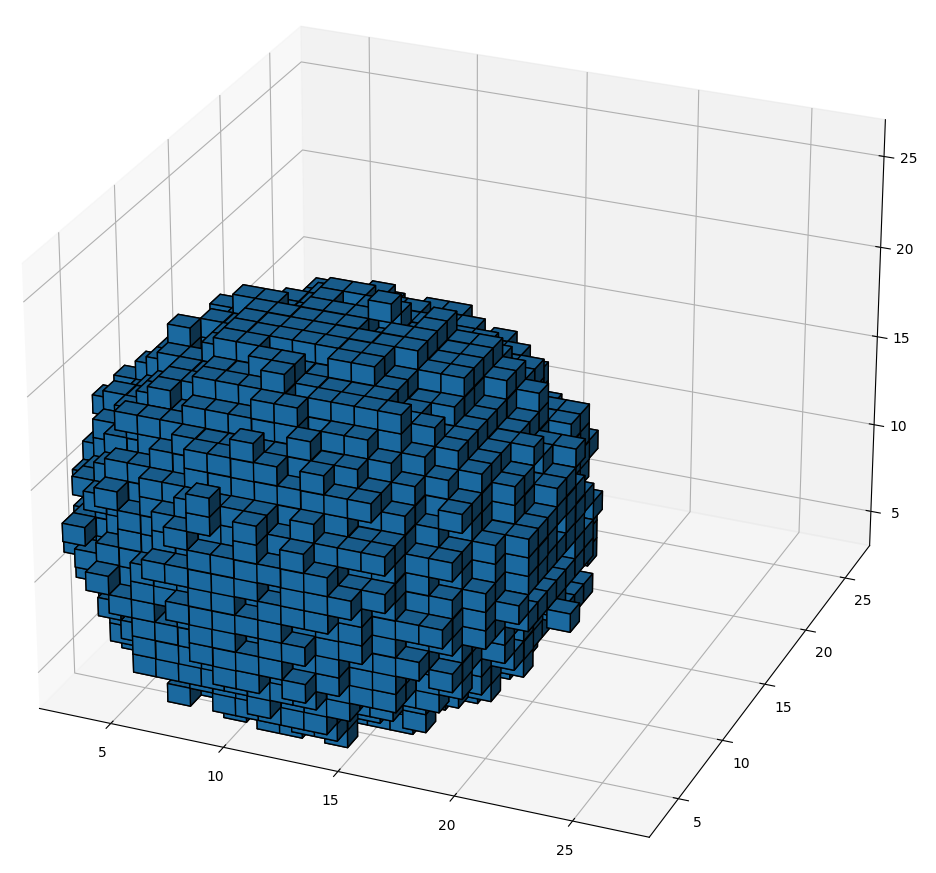
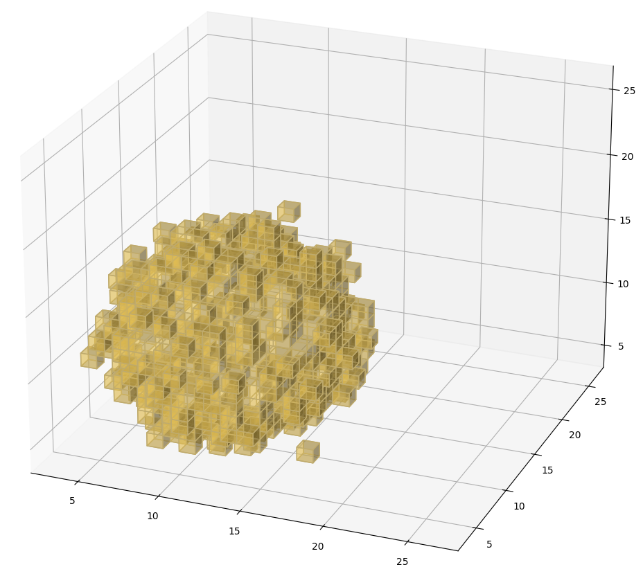

# Advent of Code 2022 Day 18

## Visualizations

The [code](day18.py) has a `draw_voxels` function that can be used to visualize the input
data. It uses the [3D voxel / volumetric plot](https://matplotlib.org/stable/gallery/mplot3d/voxels.html) feature of [matplotlib](https://matplotlib.org/).

Add `-v` or `--visualize` to either `./sample.sh` or `./run.sh` to generate the
plots.

### Plots of the sample data

#### First nine cubes and a gap

First situation when a gap in the structure occurs.
Rendered voxels are `cubes[:9]`, plus the gap in blue at `(2, 2, 5)`.
The gap is a candidate when checking for air pockets, but as it will reach the
edge when grown, it will be discarded. The shown structure does not have any
air pockets.

#### Sample data with air gap

Here we can see the air pocket that is created when the last cube is added in
front of the hole at the top part. Rendered voxels are `cubes`, and the air
pocket at `(2, 2, 5)` in blue.

### Plot of test data

Cubes of the test case `test_find_air_cubes_long_tube_closed`, with the enclosed
air pocket inside.

### Plots of the full input data

#### The lava droplet

Somewhere hidden in there are air pockets…

#### The air pockets

