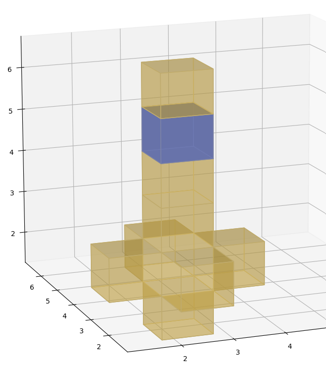
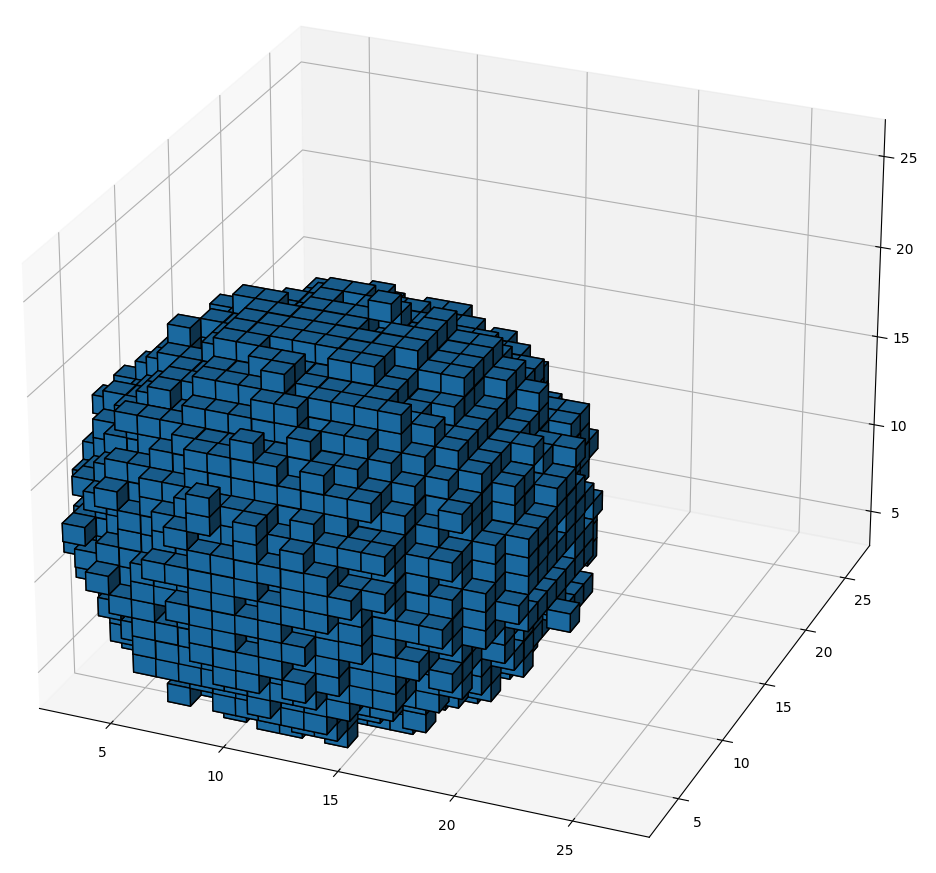

# Advent of Code 2022 Day 18

## Visualizations

The [code](day18.py) has a `draw_voxels` function that can be used to
visualize the input data. It uses the
[3D voxel / volumetric plot](https://matplotlib.org/stable/gallery/mplot3d/voxels.html)
feature of [matplotlib](https://matplotlib.org/).

### Plot of a part of the sample data

### Plot of the full input data

