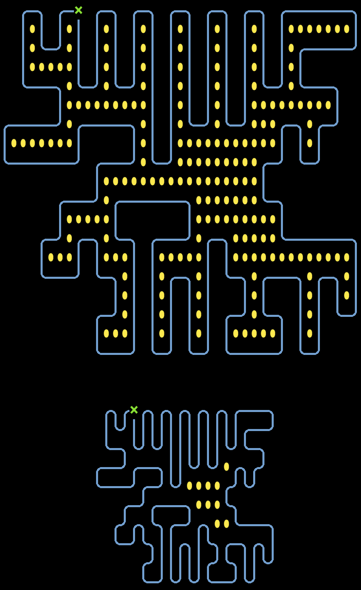

# Advent of Code 2023 Day 10

To find the enclosed areas between the pipe path, I had to increase the whole
grid by a factor of two, so that the "running between the pipes" works as
expected.

For the final result, the grid is scaled down again (throwing away all entries
with odd coordinates).

## Sample Input Visualization

## Real Input Visualization

