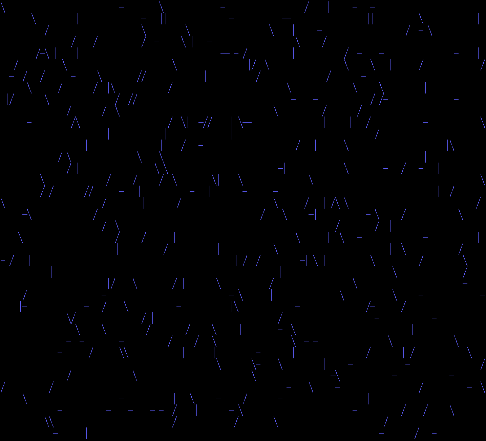

# Advent of Code 2023 Day 16

Terminal visualization with [curses](https://docs.python.org/3/howto/curses.html).

Start with `./sample.sh --visualize` or `./run.sh --visualize`.

Field will be trimmed to fit the terminal size. This means that the laser is
likely to take a different path than the one computed for the solution based on
the full input. Input data has 110 lines, your terminal probably has less than
that. Sample (10×10) easily fits, but is rather boring.

## Version 2

Made laser beam shades of green, add blue background to mirrors when the laser
has hit them.

## Version 1

