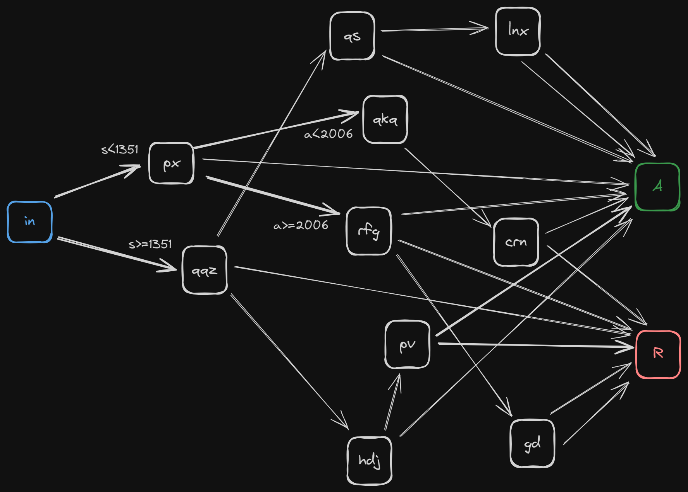

# Advent of Code 2023 Day 19

To finally come up with a solution for part 2, I drew the sample input as a
graph in [Excalidraw](https://excalidraw.com/):

Finding all paths from `in` to `A` was easy, but keeping the range conditions
for `x`, `m`, `a`, and `s` along the way updated was quite tricky. For a very
long time, I did not consider that when *not* taking an edge away from a node,
and moving on to the next edge, the range conditions have to be reduced by
applying the *inverse* of the rule. So, for example:

- going from `in` to `px` reduces the `s` range from `[1..4000]` to `[1..1350]`
- going from `in` to `qqz` reduces the `s` range from `[1..4000]` to
  `[1351..4000]`, because we can only go this way, if the `in`→`px` edge is
  *not* taken

Once this has become clear, the implementation is not that hard:

- updating the ranges bases is done by
  [`apply()`](https://github.com/yogan/advent-of-code/blob/main/2023/day-19/day19.py#L37)
  and [`apply_inverse()`](https://github.com/yogan/advent-of-code/blob/main/2023/day-19/day19.py#L59)
  in the `Rule` class
- path-finding is done via DFS with a queue in
  [`traverse()`](https://github.com/yogan/advent-of-code/blob/main/2023/day-19/day19.py#L120)
  - the range values are kept in tuples besides the current node in the queue
  - to not mix things up, we *first* have to enqueue the target node of a rule
    with the (regularly) updated range values, and *then* locally update the
    range values with the inverse of the rule, so that the next rule entry in
    the workflow has those as the base values
  - base conditions are reaching either the reject node `R` (doing nothing) or
    the accept node `A` (updating the number of combinations by multiplying the
    range sizes)
