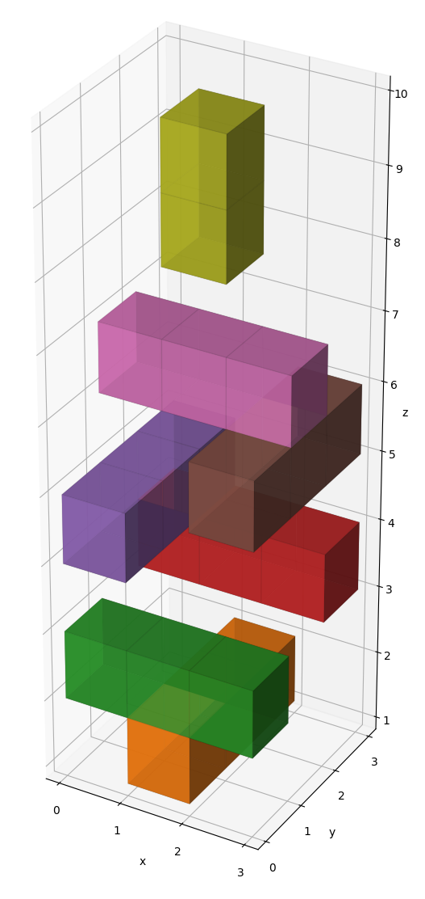
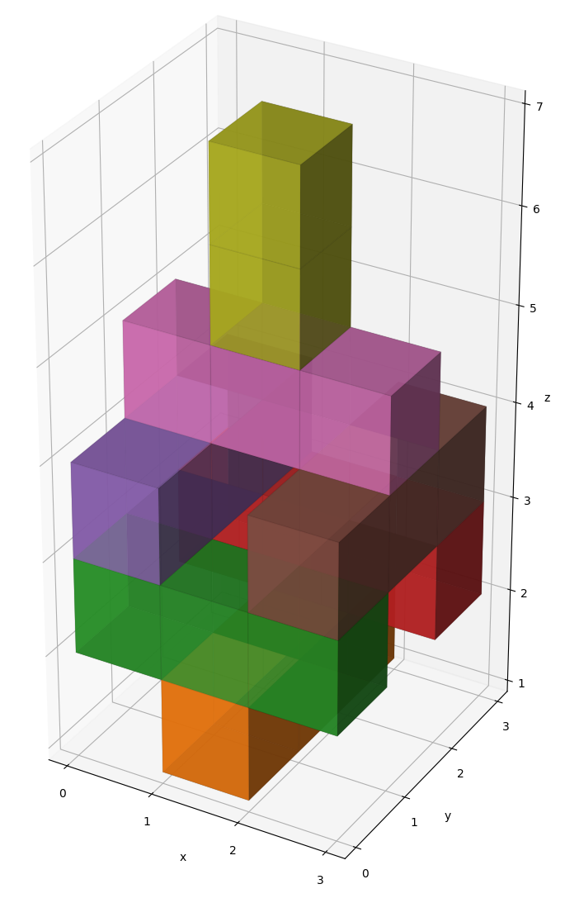
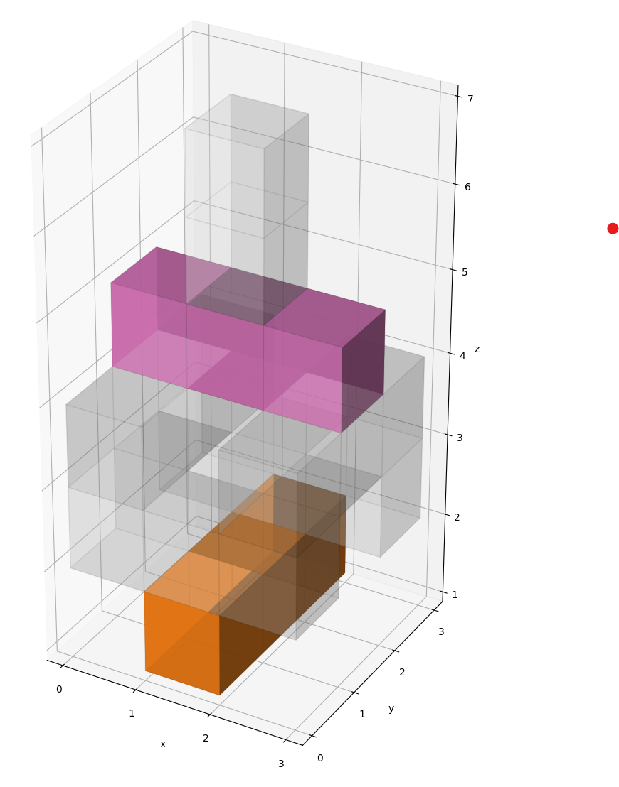
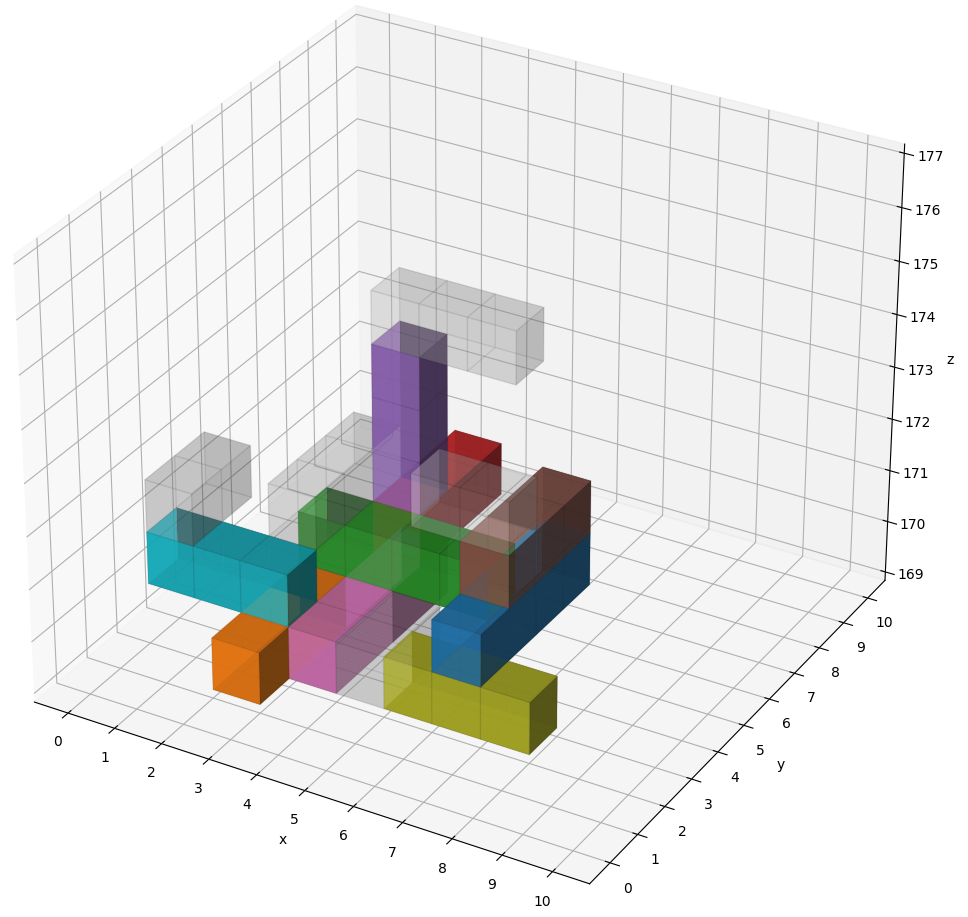
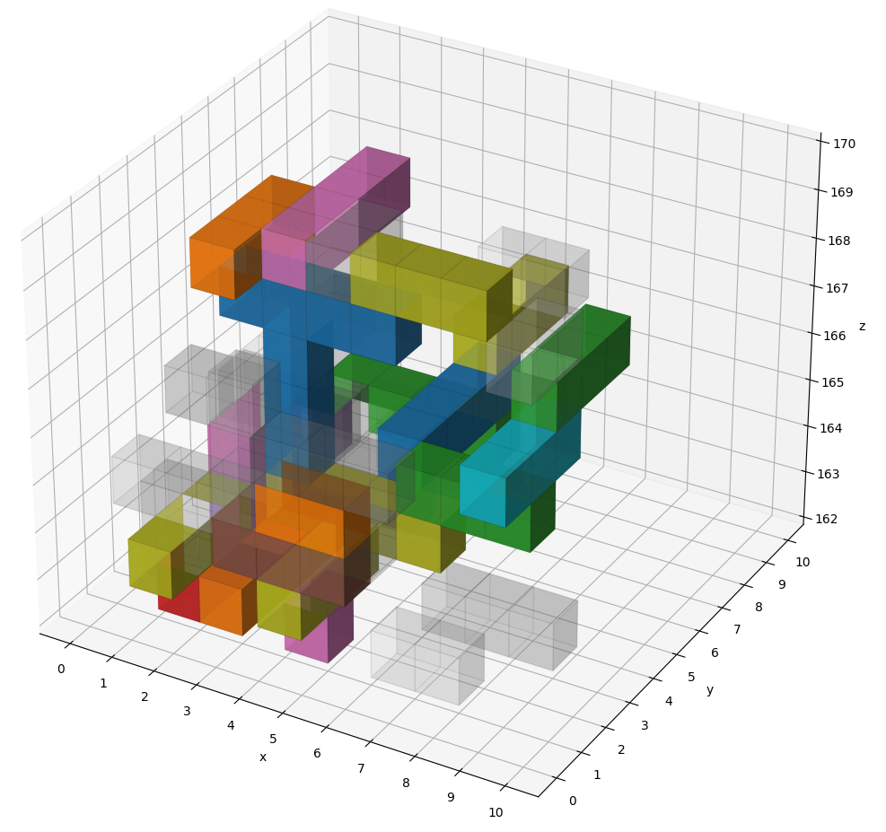
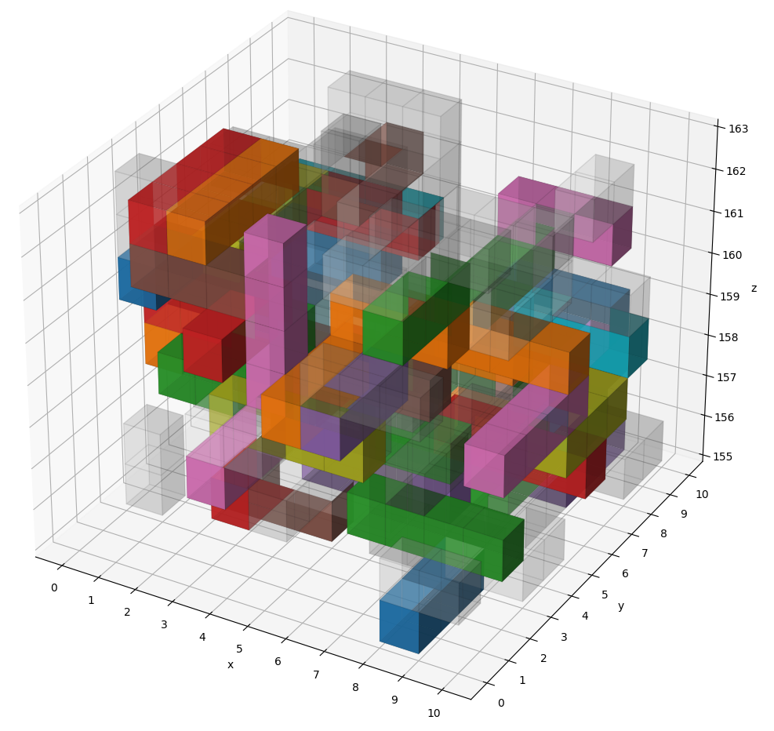
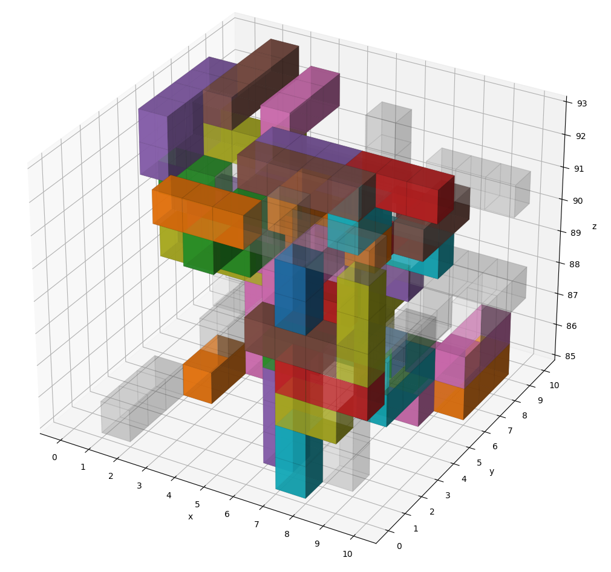
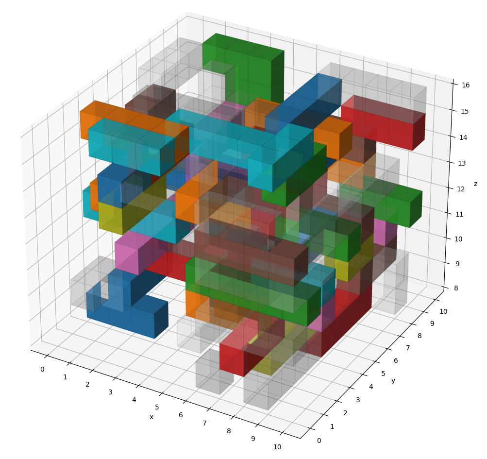
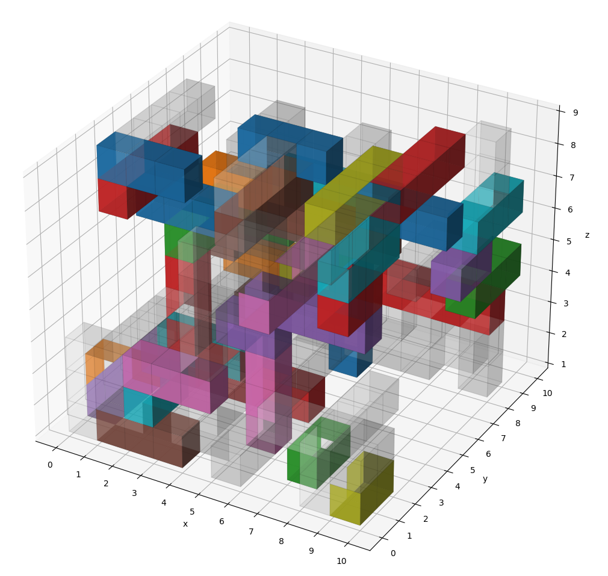

# Advent of Code 2023 Day 22

Some 3D visualizations that help me debug my solution. Created with the
[3D voxel / volumetric plot](https://matplotlib.org/stable/gallery/mplot3d/voxels.html)
feature of [Matplotlib](https://matplotlib.org).

## Sample

## Real Input

