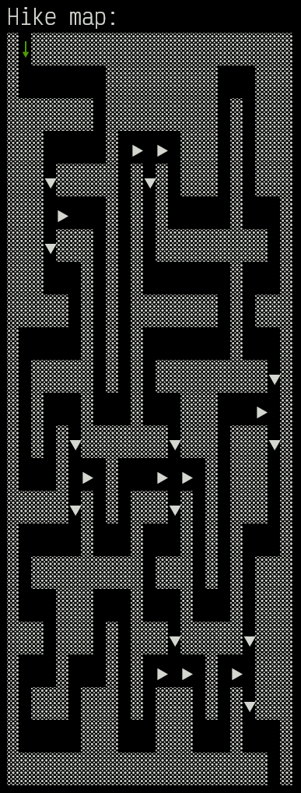
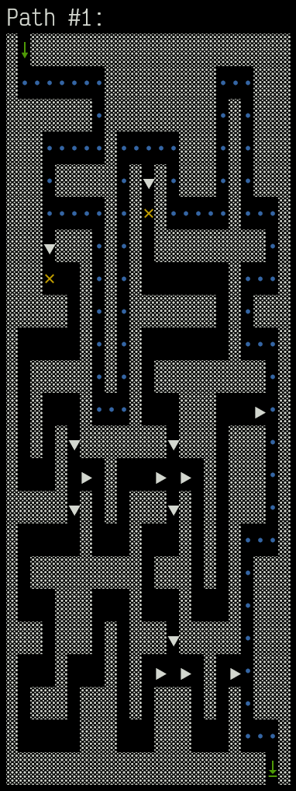
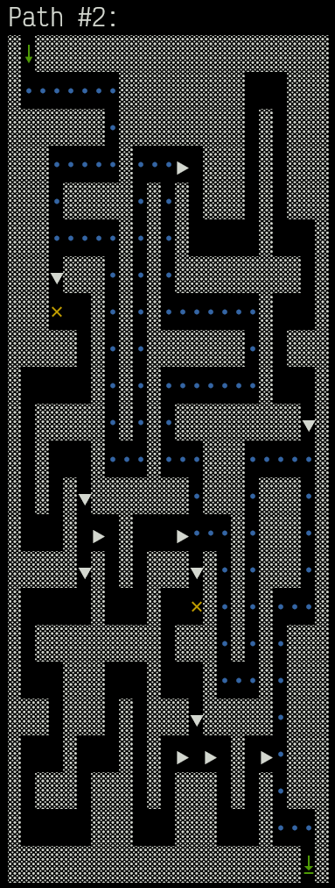
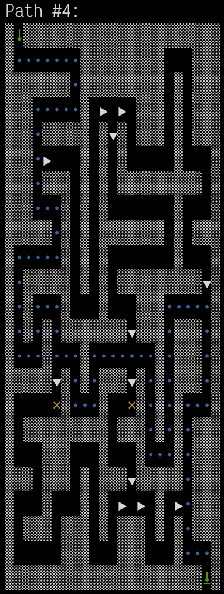
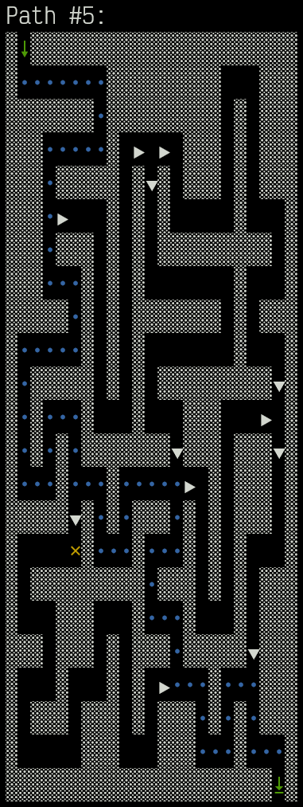
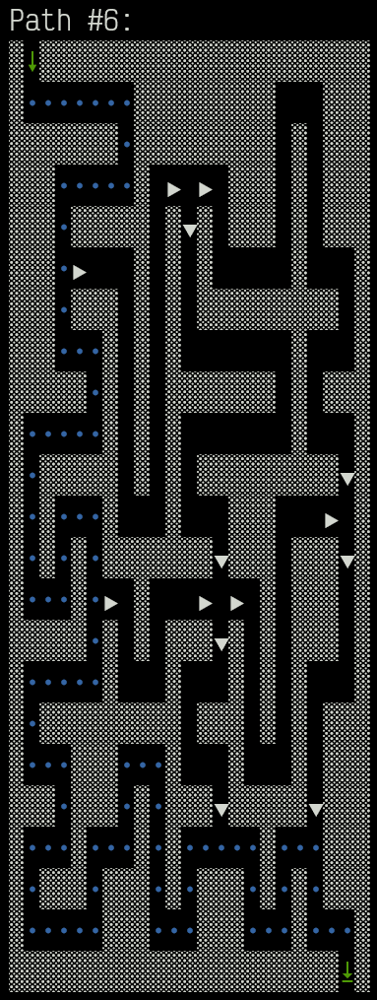
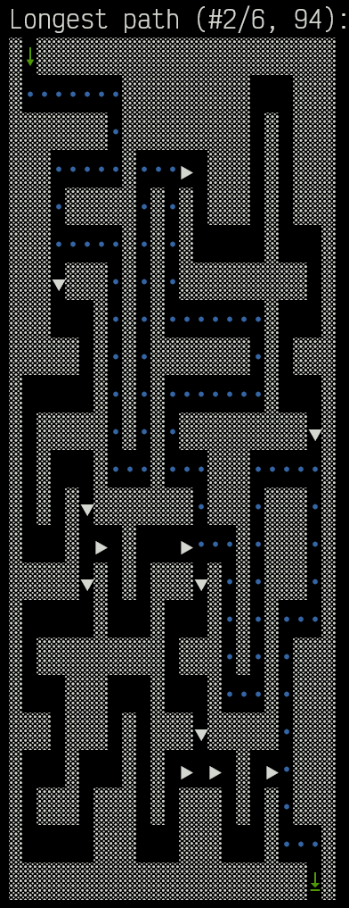
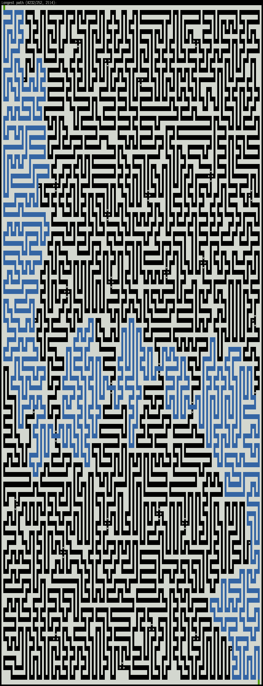

# Advent of Code 2023 Day 23: A Long Walk

Part 1 was initially solved by brute-forcing all possible paths. At that time,
there was some visualization code that was very helpful in debugging – and
produced some nice images.

Even though part 2 required a complete rewrite, the pictures of the paths from
part 1 are still here to enjoy.

The visualization code can be found in
[Git commit `5b7335b`](https://github.com/yogan/advent-of-code/blob/5b7335be31b34e8fae805e23593c548ed9fc3179/2023/day-23/day23.py#L75).

The [updated code](https://github.com/yogan/advent-of-code/blob/main/2023/day-23-python/day23.py)
that solves both parts operates on a graph of the maze, and therefore no longer
has complete paths to visualize. A description of the algorithm can be found in
the [main project README](../../README.md).

## Sample

The yellow crosses show starting positions of paths yet to be explored.

## Real Input

