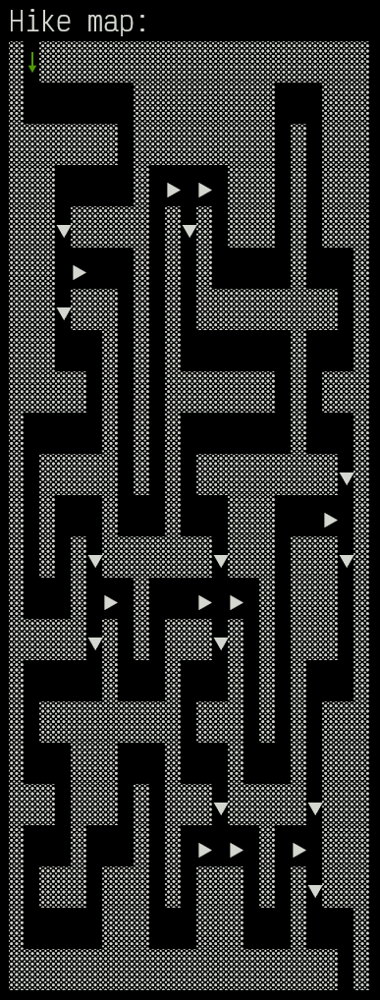
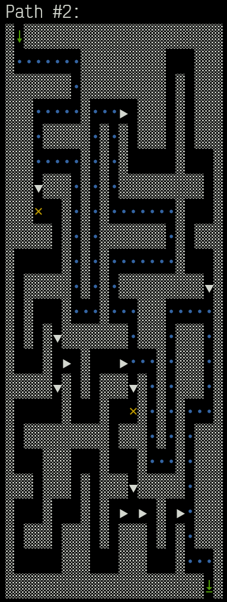
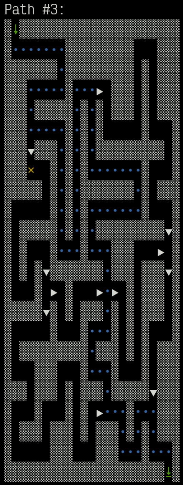
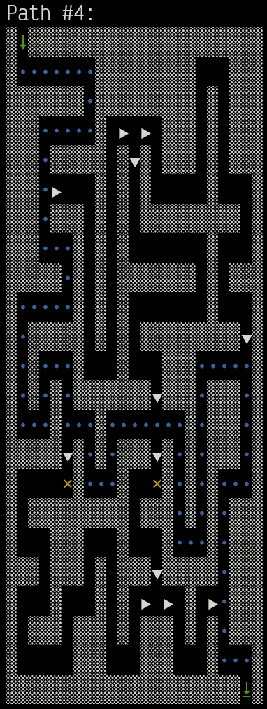
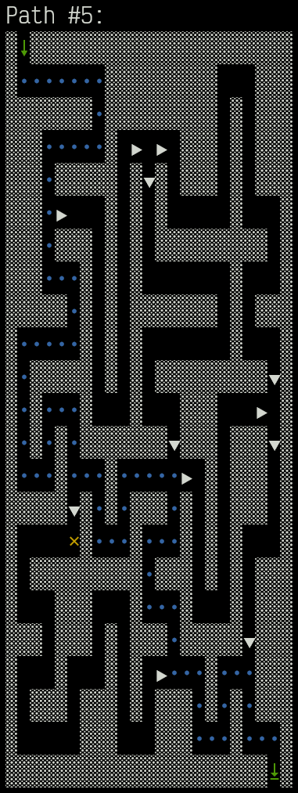
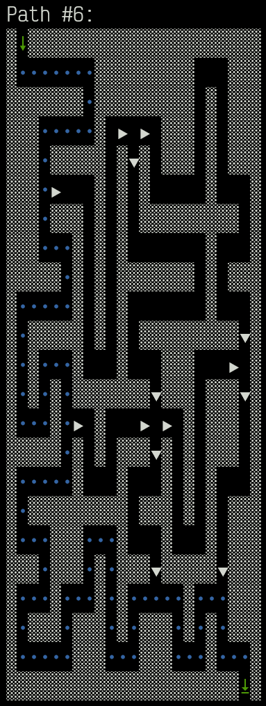
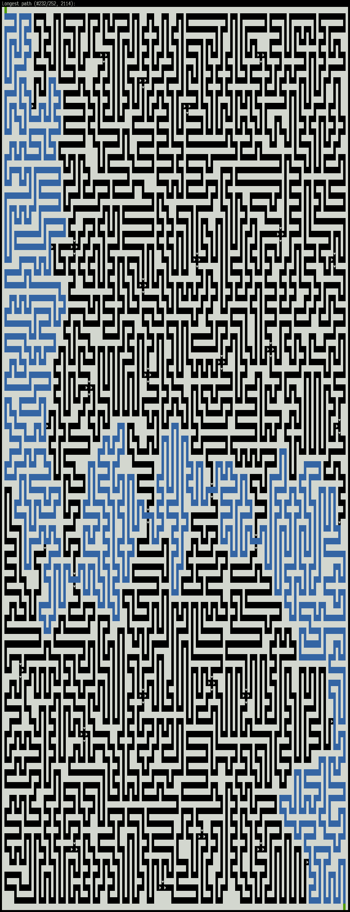

# Advent of Code 2023 Day 23: A Long Walk

All scripts (`run.sh`, `sample.sh`, `watch*.sh`) accept an optional
`--visualize` flag to print the trail maze and the found paths to the terminal.

For the sample, the initial empty maze is printed, followed by each individual
found path. Finally, the longest path is shown.

For the real input, given its size, only the longest path is printed. The
representation is also a bit different, as you'll probably want to zoom out to
see more of the whole maze at once.

## Sample

The yellow crosses show starting positions of paths yet to be explored.

## Real Input

