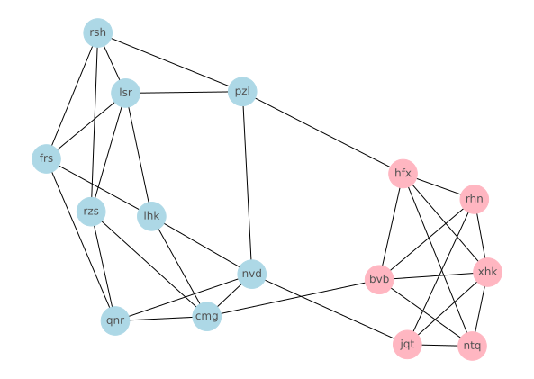

# Advent of Code 2023 Day 25: Snowverload

## Approach

To find the two components of the graph, we can use a flow-based approach. The
flow capacity of each edge in the graph shall be 1.

We do know that when we take away three distinct edges, the graph will be split
into two components. Let's call the vertices of those components *S* and *T*.

For every pair *u* and *v* of vertices in the graph, the
[maximum flow rate](https://en.wikipedia.org/wiki/Maximum_flow_problem) from
*u* to *v* is either:

- exactly 3, when *u ∈ S* and *v ∈ T*, or vice versa
- greater than 3, when *u* and *v* are either both in *S* or both in *T*

The reason for this is that if the flow rate is greater than 3 between two
vertices, they will still be connected by at least one edge when we remove three
edges from the graph.

With the three edges found and removed, we extract the two components from the
modified graph. The product of their sizes is our answer.

## Result for the Sample

The graph shows the original graph with all vertices and edges. Using the
calculated components *S* and *T*, each vertices is colored either red or blue
depending on which component it belongs to. We can clearly see the three edges
that need to be removed.

The graph can be plotted with `./sample.sh --visualize`.
